# Lex & Justice

Lex & Justice is a website for a fictional London-based professional law firm. The site presents the firm as a full-service practice with corporate, family, real estate, employment, estate planning, and tax capabilities, and surfaces typical marketing pages such as services, team profiles, news, careers, and contact.

**View Site** → [Lex & Justice](https://behramaras.github.io/lex-and-justice/)

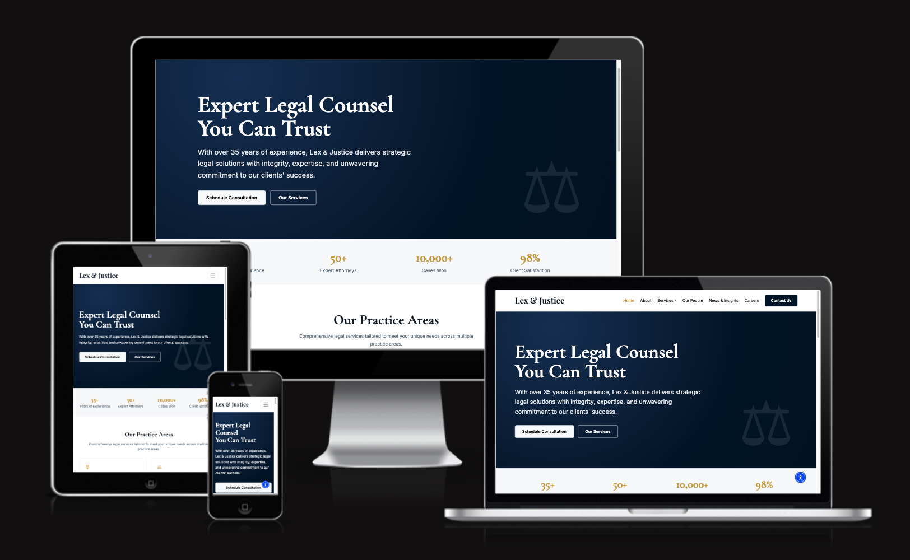

## Table of Contents

- [User Experience (UX)](#user-experience-ux)
  - [Project Goals (User Goals, Business Goals)](#project-goals-user-goals-business-goals)
  - [User Stories (Potential Client, Potential Employee, General Visitor)](#user-stories-potential-client-potential-employee-general-visitor)
- [Design](#design)
  - [Colour Palette](#colour-palette)
  - [Typography](#typography)
  - [Imagery](#imagery)
  - [Wireframes](#wireframes)
- [Features](#features)
  - [All Pages](#all-pages)
  - [Home Page](#home-page)
  - [About Page](#about-page)
  - [Services Page](#services-page)
  - [Practice Area Detail Page](#practice-area-detail-page)
  - [Our People Page](#our-people-page)
  - [News & Insights Page](#news--insights-page)
  - [Careers Page](#careers-page)
  - [Contact Page](#contact-page)
  - [Under Construction Page](#under-construction-page)
  - [Privacy Policy Page](#privacy-policy-page)
  - [Terms of Service Page](#terms-of-service-page)
  - [Disclaimer Page](#disclaimer-page)
- [Accessibility](#accessibility)
- [Testing](#testing)
- [Credits](#credits)
  - [Media](#media)
  - [Code and Resources Used](#code-and-resources-used)
  - [Technologies and Tools Used](#technologies-and-tools-used)
- [Deployment and Local Development](#deployment-and-local-development)
  - [Deployment](#deployment)
  - [Local Development (How to Fork, How to Clone)](#local-development)

---

## User Experience (UX)

### Project Goals (User Goals, Business Goals)

#### User Goals

**Potential clients** land on the site to confirm the firm looks legitimate, understand which matters it handles, and reach a lawyer. They typically visit `index.html`, `services.html` or `practice-area-detail.html`, `team.html`, and `contact.html`. They may return when their matter progresses or when comparing firms—often a small number of visits, but each session is high intent.

**Potential employees** explore culture, open roles, and the firm’s story. They usually open `careers.html`, `about.html`, and sometimes `team.html` and `news.html`. Candidates often return once or twice while preparing an application or after an interview.

**General visitors** (researchers, students, press) skim for positioning, recent thinking, and basic facts. They may read `news.html`, `about.html`, and `contact.html`, and occasionally `services.html`. Return frequency is low unless they follow the firm’s content over time.

#### Business Goals

The firm wants a professional public-facing website that builds credibility, communicates legal expertise clearly, makes it easy for clients to get in touch, and attracts talented legal professionals.

### User Stories (Potential Client, Potential Employee, General Visitor)

#### Story 1 — Potential Client

**Situation:** Someone facing a family law issue searches online for London solicitors, clicks through to Lex & Justice, and wants reassurance, relevant expertise, and a way to book or message the firm.

**Story:**

1. Opens the home page and scans the hero and practice area preview.
2. Goes to **Services** to see the full list of offerings.
3. Opens **Family Law** (via the same shared practice area detail template used for every area).
4. Reads the approach copy and FAQ, and checks the sidebar for consultation options.
5. Visits **Our People** to read lawyer bios.
6. Opens **Contact** and completes the inquiry form with consent.
7. Sees the success modal confirming the message was received.

**Acceptance criteria**

- **Home (`index.html`):** Hero messaging, practice preview, and clear paths to services and contact.
- **Services (`services.html`):** Family Law appears as a practice card with link-through to the detail page.
- **Practice area detail (`practice-area-detail.html`):** Navigable content structure with FAQ and sidebar CTA.
- **Our People (`team.html`):** Profile cards with role, area, and contact affordances.
- **Contact (`contact.html`):** Labelled fields, required consent, and confirmation modal after submit.

#### Story 2 — Potential Employee

**Situation:** A junior solicitor finds the careers section, compares openings, and wants to understand the firm before applying.

**Story:**

1. Lands on **Careers** from the main navigation.
2. Reviews headline stats under “Why Work With Us.”
3. Reads **Current Openings** and follows “View Details” where available (stub links go to the under-construction page).
4. Reviews **Benefits & Perks.**
5. Visits **About** to read the firm’s mission, values, and history.
6. Returns to **Careers** and completes the application form (including résumé upload).
7. Sees the application success modal.

**Acceptance criteria**

- **Careers (`careers.html`):** Openings grid, benefits list, and application form with validation attributes.
- **About (`about.html`):** Story, mission/values, timeline, and CTAs toward people and contact.
- **Under construction (`under-construction.html`):** Predictable fallback when job detail pages are not yet built.

#### Story 3 — General Visitor

**Situation:** A journalist researching London law firms needs quick context, recent articles, and an official contact path.

**Story:**

1. Opens **News & Insights** to scan headlines and categories.
2. Reads excerpts and metadata (read time, author, date).
3. Uses **Load More Articles** (stub) where applicable.
4. Opens **About** for firm history and positioning.
5. Optionally subscribes via the newsletter strip (stub action).
6. Uses **Contact** to send a message or note office details from the sidebar.

**Acceptance criteria**

- **News (`news.html`):** Article cards with accessible imagery and structured metadata; newsletter form present.
- **About (`about.html`):** Credible firm narrative and milestones.
- **Contact (`contact.html`):** Form plus published-style office phone/email/address blocks consistent with the footer.

---

## Design

### Colour Palette

Deep navy and restrained gold communicate trust, authority, and prestige—expectations clients associate with established legal practices—while crisp whites and soft greys keep long-form content readable and calm.

**Background colours:** `#FFFFFF`, `#F7F8FA`

**Navy (primary):** `#03142D`, `#061B3A`, `#1F3557`

**Gold (accent):** `#C9A227`, `#DFD39F`

**Text colours:** `#1D2733`, `#667586`

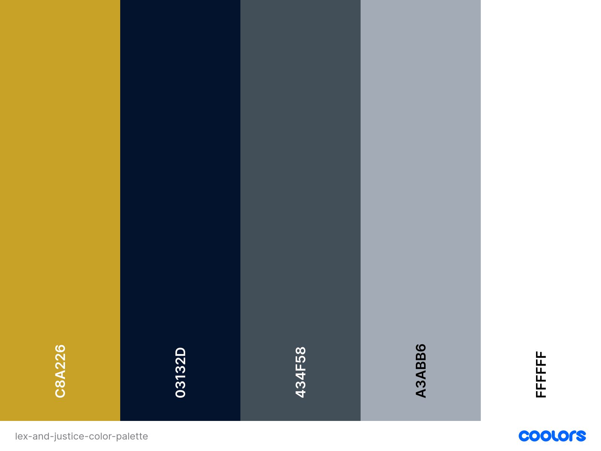

### Typography

The project loads three families from [Google Fonts](https://fonts.google.com/) (see `index.html` and `css/style.css`).

**Cormorant Garamond (primary heading font)**

- **Usage:** `h1`–`h5` headings and section titles (see base typography rules in `css/style.css`).
- **Reason:** An elegant, high-contrast serif that conveys tradition and authority — well suited to a law firm.

**Playfair Display (brand font)**

- **Usage:** Logo/brand mark (`.brand-mark` / `.brand-font`) and select display treatments.
- **Reason:** A distinguished serif that pairs with Cormorant Garamond to reinforce the firm’s premium identity.

**Inter (body font)**

- **Usage:** Body text, navigation, forms, and descriptive copy (`body` in `css/style.css`).
- **Reason:** A clean, modern sans-serif optimised for screen readability.

### Imagery

Photography and illustration are sourced from [Pixabay](https://pixabay.com/photos/), and [Freepik](https://www.freepik.com/) and selected to suggest professionalism, scale, and trust—legal contexts, workplaces, and civic imagery. The About page firm story uses `assets/img/about/our_story.jpg` beside the “Our Story” narrative.

### Wireframes

Wireframes were created in [Miro](https://miro.com/) for desktop layout only.

#### Home Page Wireframe

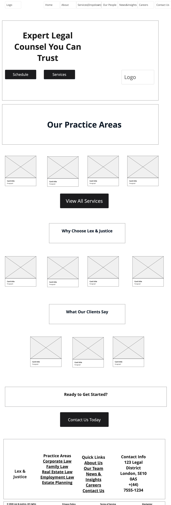

#### About Page Wireframe

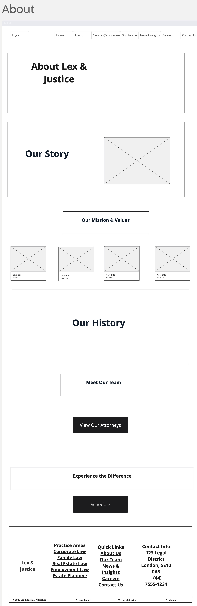

#### Services Page Wireframe

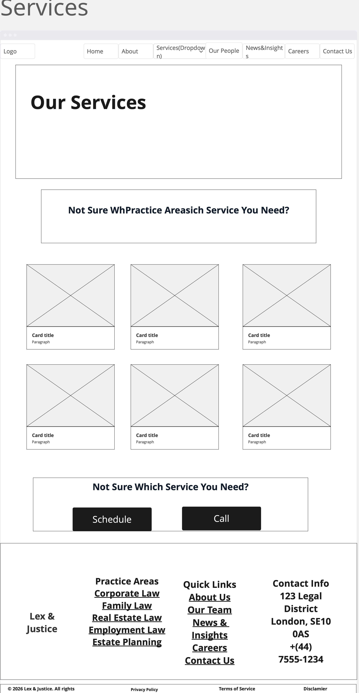

#### Practice Area Detail Page Wireframe

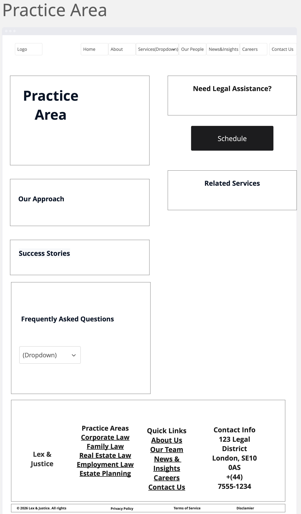

#### Our People Page Wireframe

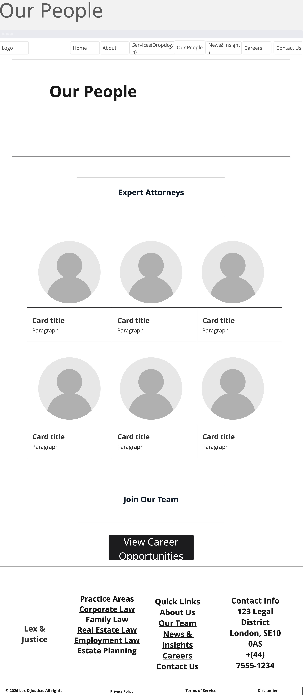

#### News & Insights Page Wireframe

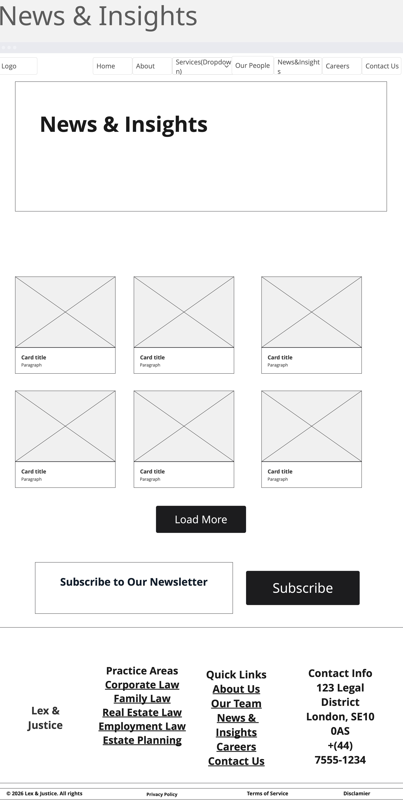

#### Careers Page Wireframe

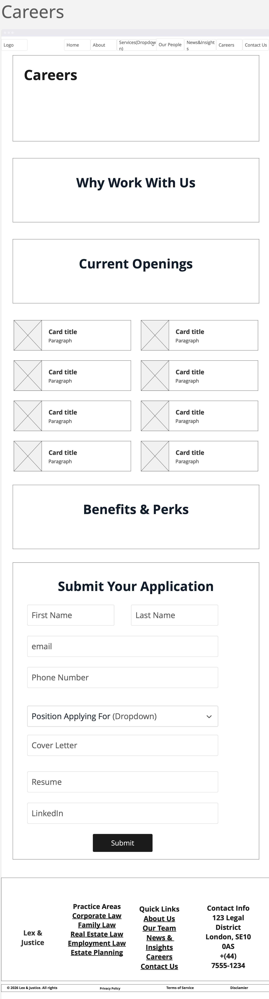

#### Contact Page Wireframe

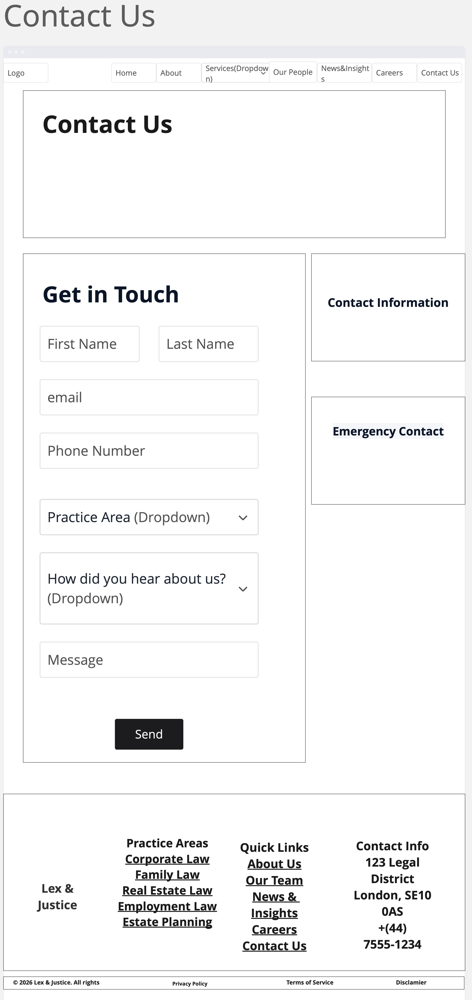

#### Under Construction Page Wireframe

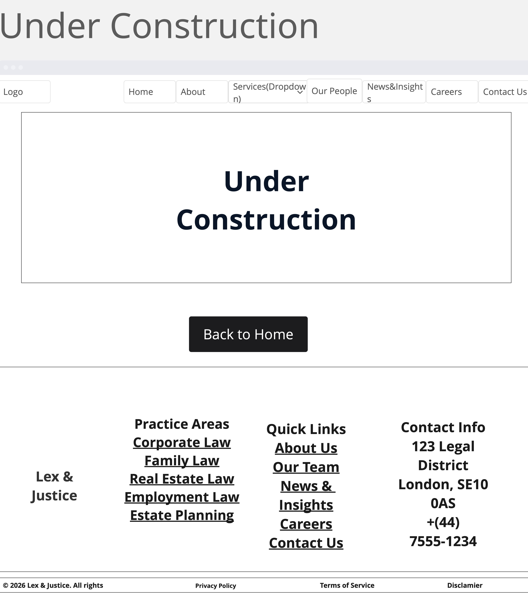

---

## Features

The repository ships nine HTML documents at the site root: `index.html`, `about.html`, `services.html`, `practice-area-detail.html`, `team.html`, `news.html`, `careers.html`, `contact.html`, and `under-construction.html`. Shared chrome (navigation, footer, UserWay script) is consistent across them.

### All Pages

- **Navbar:** Sticky Bootstrap navbar with white background; collapses to a toggler (“hamburger”) on small viewports; primary navigation plus a Services dropdown (Corporate Law through Tax Law, plus “All Services”); gold-toned hover/focus states on links in `css/style.css`; **Contact Us** button linking to `contact.html`.
- **Footer:** Four columns—brand/tagline and social links (LinkedIn live URL, Twitter stub), Practice Areas links (five areas in the list), Quick Links (About, Team, News, Careers, Contact), and Contact Info (address/phone/email consistent with the rest of the site)—plus a bottom bar with copyright and legal text links.
- **Third-party accessibility widget:** [UserWay](https://cdn.userway.org/widget.js) is loaded on each page; site comments in HTML/CSS describe it as pinned to the bottom-right.

There are no separate `privacy-policy.html` / `terms.html` / `disclaimer.html` files in this repository; footer links for Privacy Policy, Terms of Service, and Disclaimer currently point to `under-construction.html`.

### Home Page

- **Hero:** Navy gradient band with two-line headline, supporting paragraph, and “Schedule Consultation” / “Our Services” buttons (`index.html`).
- **Stats strip:** Four headline metrics (years, attorneys, cases won, satisfaction) on a soft grey band, introduced with a visually hidden `h2` and `aria-labelledby`.
- **Practice Areas preview:** Four cards (Corporate, Family, Real Estate, Employment) plus **View All Services**.
- **Why Choose Us:** Four feature columns (Proven Results, Expert Counsel, Responsive Service, Trusted Integrity) on a muted background.
- **Testimonials:** Three client quote cards with names and roles.
- **Closing CTA:** “Ready to Get Started?” band with button to contact.


### About Page

- **Hero:** Short navy hero introducing the page.
- **Our Story:** Text plus `assets/img/about/our_story.jpg` (lazy-loaded).
- **Mission & Values:** Four value cards (Integrity, Excellence, Client Focus, Innovation).
- **Our History:** Six-row timeline (1989–2026).
- **Meet Our Team CTA:** Links to `team.html`.
- **Experience the Difference CTA:** Links to `contact.html`.

### Services Page

- **Hero:** Inner-page hero with title and intro.
- **Practice Areas:** Six cards—Corporate Law, Family Law, Real Estate Law, Employment Law, Estate Planning, Tax Law—each linking to the shared detail template.
- **Help CTA strip:** “Not Sure Which Service You Need?” with consultation and phone buttons.

### Practice Area Detail Page

- **Breadcrumb bar:** Home → Services → current page (`nav` with `aria-label="Breadcrumb"`).
- **Main column:** Title, “Our Approach” content, success-story style callout, and FAQ accordion (Bootstrap).
- **Sidebar:** Consultation CTA with phone/email shortcuts and related service links.

### Our People Page

- **Hero:** Intro copy for the team.
- **Expert Attorneys:** Six profile cards with photo, name, title, practice area, bio, and email/LinkedIn icon links.
- **Join Our Team CTA:** Muted band linking to `careers.html`.

### News & Insights Page

- **Hero:** Page title and positioning copy.
- **Article grid:** Six cards with image, category tag, title, excerpt, read time, author, date, and read link (article targets use `under-construction.html` where full posts are not built).
- **Load More Articles:** Button linking to `under-construction.html`.
- **Newsletter:** Email field and subscribe button (form action stub).

### Careers Page

- **Hero:** Careers introduction.
- **Why Work With Us:** Four headline stats.
- **Current Openings:** Job cards with title, department, location, employment type, and stub detail links.
- **Benefits & Perks:** Grid of bullet points.
- **Application Form:** First and last name, email, phone, position select, cover letter, résumé upload, optional LinkedIn URL, submit triggering a success modal; disclaimer text referencing privacy/terms (still linked via footer stubs).

### Contact Page

- **Hero:** Contact introduction.
- **Get in Touch form:** First name, last name, email, phone, practice area select, “how did you hear about us” select, message, consent checkbox; submit opens a Bootstrap success modal (`type="button"` trigger in HTML).
- **Contact Information:** Lex & Justice London office (10 Downing Street, London SW1A 2AA), phone, email, office hours list, and embedded Google Map.
- **Emergency Contact card:** Additional phone line for urgent matters.

### Under Construction Page

- **Shared navbar and footer** as elsewhere.
- **Main card:** Construction icon, heading, short message, and **Back to Home** button.

### Privacy Policy Page

Not implemented as a standalone page; the footer’s “Privacy Policy” anchor targets `under-construction.html`. 

### Terms of Service Page

Not implemented as a standalone page; the footer’s “Terms of Service” anchor targets `under-construction.html`. 

### Disclaimer Page

Not implemented as a standalone page; the footer’s “Disclaimer” anchor targets `under-construction.html`. 

---

## Accessibility

- Semantic landmarks are used throughout (`header`, `nav`, `main`, `section`, `article`, `aside`, `footer`) as seen in the HTML sources.
- Several sections expose headings or labels to assistive technology via Bootstrap’s `visually-hidden` pattern where duplicate visible titles would be noisy (e.g., stats and news grid wrappers).
- Decorative Bootstrap Icons are marked `aria-hidden="true"` in many components; icon-only controls often include `aria-label` (navbar toggler, social links, team contact icons).
- Breadcrumb navigation includes `aria-label="Breadcrumb"` and `aria-current="page"` on the active crumb.
- Forms pair visible `<label>` elements (or an accessible alternative such as `label.visually-hidden` on the newsletter field) with inputs; required fields use HTML5 validation attributes.
- Modals specify `aria-labelledby` / `aria-hidden` in line with Bootstrap patterns.
- `loading="lazy"` is applied on image tags that carry substantial media (About story, team photos, news cards).
- The UserWay embed provides an additional accessibility menu for end users.

---

## Testing

### Validation Testing

#### HTML Validation

All HTML pages were tested using the [W3C Markup Validator](https://validator.w3.org/). Screenshots of results are stored in `documentation/errors/validator.v3/`.

**index.html** — No errors


---

**about.html** — No errors


---

**services.html** — No errors


---

**practice-area-detail.html** — No errors


---

**team.html** — No errors


---

**news.html** — No errors


---

**careers.html** — No errors


---

**contact.html** — No errors


---

**under-construction.html** — No errors


#### CSS Validation
The custom stylesheet `css/style.css` was tested using the [W3C Jigsaw CSS Validator](https://jigsaw.w3.org/css-validator/). 

Result: No errors found in custom CSS.

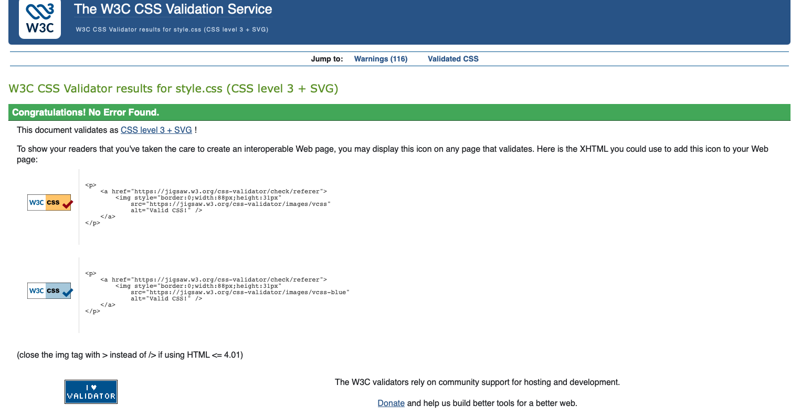

#### Lighthouse Testing

Performance, Accessibility, Best Practices, and SEO were tested using Google Lighthouse. Screenshots stored in `documentation/lighthouse/`.

**Desktop**
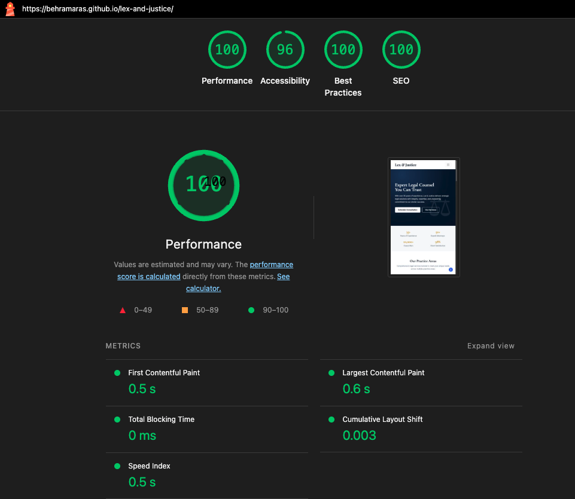

**Mobile**
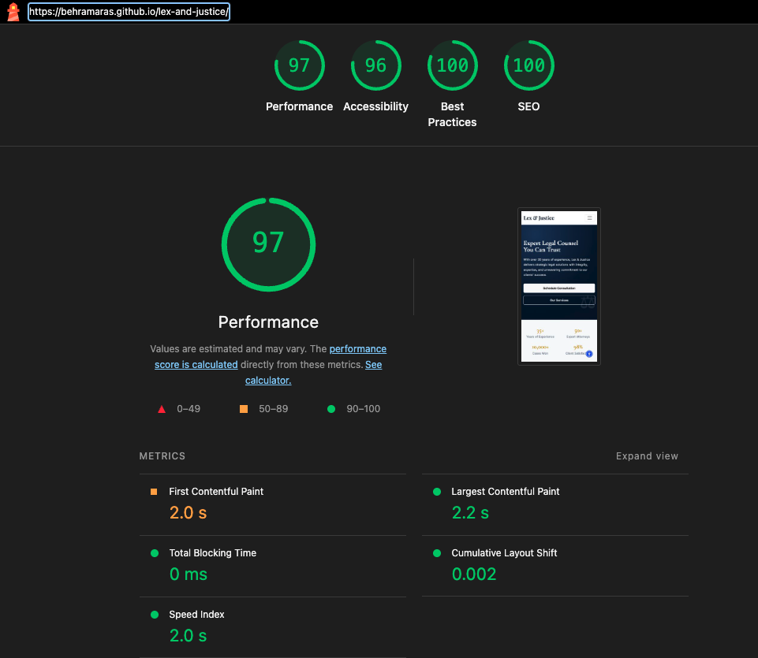

---

## Credits

### Media

-> Images sourced from [Pixabay](https://pixabay.com/photos/), and [Freepik](https://www.freepik.com/)

-> Icons from [Bootstrap Icons](https://icons.getbootstrap.com/) v1.11.3

-> Multi-device mockup created using [Am I Responsive](https://fireship.dev/amiresponsive)

-> Colour palette image created using [Coolors](https://coolors.co/)

### Code and Resources Used

-> Navbar built from Bootstrap 5 navbar template — [Bootstrap Docs](https://getbootstrap.com/docs/5.3/components/navbar/)

-> Accordion component for FAQ sections — [Bootstrap Docs](https://getbootstrap.com/docs/5.3/components/accordion/)

-> Form validation using HTML5 attributes — [Bootstrap Docs](https://getbootstrap.com/docs/5.3/forms/validation/)

-> Card components for services, team, and news — [Bootstrap Docs](https://getbootstrap.com/docs/5.3/components/card/)

-> Sticky navbar implementation — [Bootstrap Docs](https://getbootstrap.com/docs/5.3/helpers/position/)

-> CSS custom properties (variables) for theming — [MDN Docs](https://developer.mozilla.org/en-US/docs/Web/CSS/Using_CSS_custom_properties)

-> Google Fonts import for Cormorant Garamond, Playfair Display, Inter — [Google Fonts](https://fonts.google.com/)

-> Design reference and inspiration — [Harbottle & Lewis](https://www.harbottle.com/) and [Kirkland & Ellis](https://www.kirkland.com/)

-> Figma design prototype created using [Figma Make](https://www.figma.com/make/)

-> Wireframes created using [Miro](https://miro.com/)

-> AI tools (Claude, ChatGPT) used to assist with generating text content for the website

### Technologies and Tools Used

VS Code — Code editor used for development

Git / GitHub — Version control and repository hosting — [github.com](https://github.com/)

HTML5 — Page structure and semantic markup

CSS3 — Custom styling and responsive layout

[Bootstrap 5.3](https://getbootstrap.com/) — Frontend CSS framework (project CDN pins Bootstrap **5.3.3** in HTML)

[Bootstrap Icons 1.11.3](https://icons.getbootstrap.com/) — Icon library

[Google Fonts](https://fonts.google.com/) — Cormorant Garamond, Playfair Display, Inter

[Pexels](https://www.pexels.com/) — Free stock photography

[Pixabay](https://pixabay.com/photos/) — Free stock photography

[Freepik](https://www.freepik.com/) — Free stock photography and graphics

[Figma Make](https://www.figma.com/make/) — Used to generate initial design prototype

[Am I Responsive](https://fireship.dev/amiresponsive) — Multi-device mockup generator

[Coolors](https://coolors.co/) — Colour palette generator

[Miro](https://miro.com/) — Used to create wireframes

[W3C Validator](https://validator.w3.org/) — HTML validation

[W3C Jigsaw](https://jigsaw.w3.org/css-validator/) — CSS validation

[Google Lighthouse](https://developer.chrome.com/docs/lighthouse/) — Performance, accessibility, SEO, and best practices testing. Accessed via Chrome DevTools (F12 → Lighthouse tab)

UserWay — Third-party accessibility widget injected via CDN on each page

---

## Deployment and Local Development

### Deployment

Site deployed using GitHub Pages at Lex & Justice

-> Steps to deploy a website using GitHub Pages

1. Open your GitHub repository (`https://github.com/behramaras/lex-and-justice`).
2. Open the **Settings** tab.
3. Select **Pages** from the side menu.
4. Under **Branch**, select `main` from the dropdown and click **Save**.
5. Wait a few minutes, then refresh — the live link will appear at the top of the Pages section (published site: `https://behramaras.github.io/lex-and-justice/`).

### Local Development

#### How to Fork

1. Log in or create a GitHub account.
2. Go to the repository page: `https://github.com/behramaras/lex-and-justice`
3. Click the **Fork** button in the top-right.

Concise steps can be found here: [Fork a repository (GitHub Docs)](https://docs.github.com/en/pull-requests/collaborating-with-pull-requests/working-with-forks/fork-a-repo).

#### How to Clone

1. Open the folder where you would like to clone the project.
2. Open a terminal window.
3. Enter the following command:

   ```bash
   git clone https://github.com/behramaras/lex-and-justice.git
   ```

Concise steps can be found here: [Cloning a repository (GitHub Docs)](https://docs.github.com/en/repositories/creating-and-managing-repositories/cloning-a-repository).

#### How to Run Locally

Open the project folder in VS Code and use the **Live Server** extension to preview the site. Right-click `index.html` and select **Open with Live Server**.
